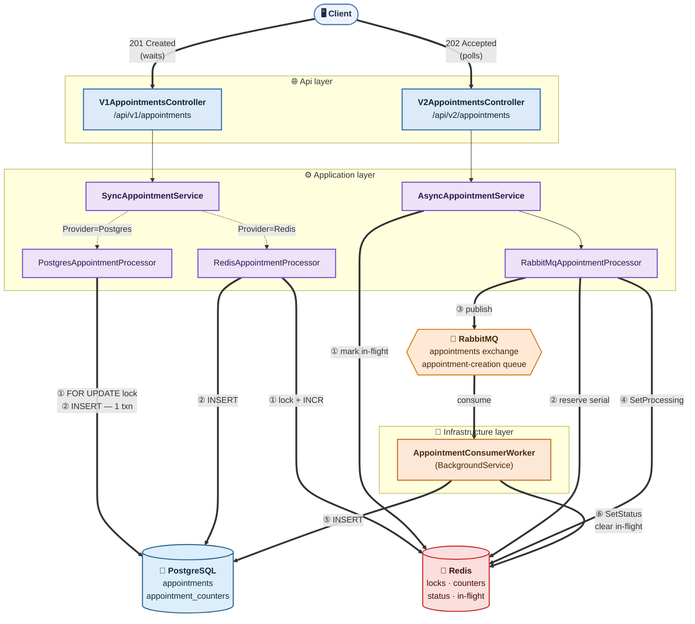
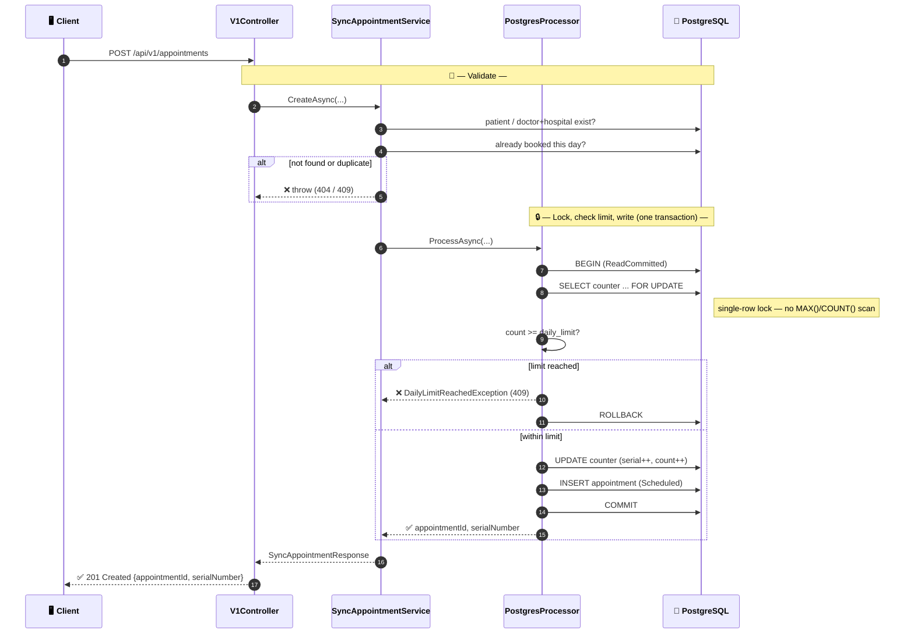
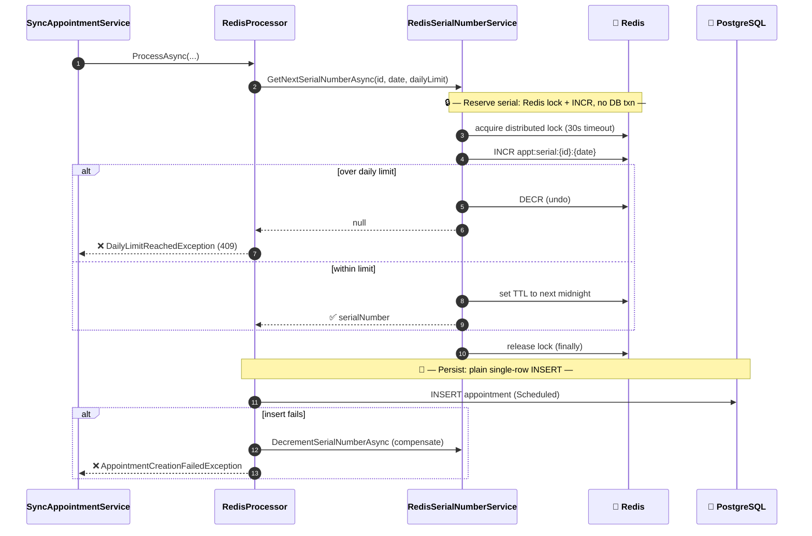
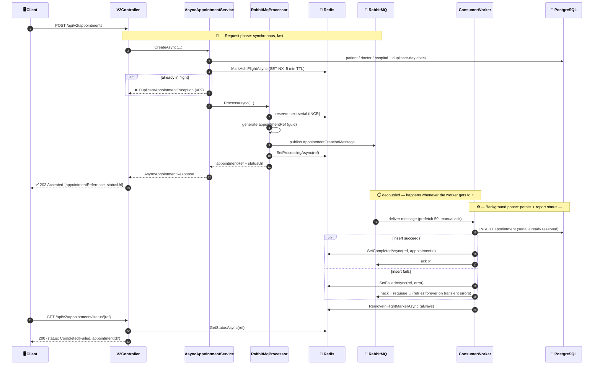
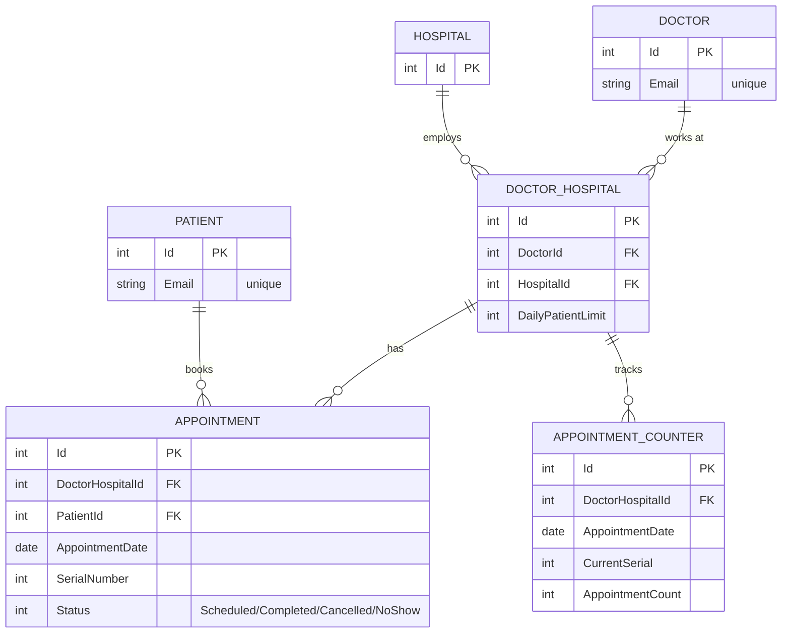

# Appointer — Doctor Appointment System

A .NET 9 hobby project for booking doctor appointments with **serial numbers** (1, 2, 3… per doctor/hospital/day) instead of time slots. The interesting part isn't CRUD — it's that the same booking operation is implemented **three different ways** (Postgres row lock, Redis distributed lock, RabbitMQ queue) behind a single `Mode`/`Provider` switch, so this doubles as a playground for comparing concurrency strategies.

> **Read this first when you come back to the project.** The diagrams below are the fastest way to re-load the mental model without re-reading the code.

## Quick start

```bash
# requires Docker Desktop running
dotnet run --project src/DoctorAppointmentSystem.AppHost
# -> Aspire dashboard: http://localhost:15000 (Postgres/Redis/RabbitMQ containers + API)
```

Switch behavior via `src/DoctorAppointmentSystem.Api/appsettings.json`:

```json
"Appointment": { "Mode": "Sync", "Provider": "Postgres" }  // Postgres | Redis
"Appointment": { "Mode": "Async", "Provider": "RabbitMq" }
```

This is read **once at startup** — changing it requires a restart, not just a config reload.

## The big picture

Everything hangs off one decision: is booking handled **synchronously in the request** (client waits for a DB write) or **asynchronously via a queue** (client gets a ticket and polls)?



Colors map to layer/technology, arrows are numbered where order matters. Solid double arrows (`==>`) are "does the work," dotted arrows (`-.->`) are "picks which processor based on config." Three layers, top to bottom: **Api** (controllers only route + shape HTTP), **Application** (services validate, processors do the actual work), **Infrastructure** (EF Core, RabbitMQ publisher/consumer, Redis-backed helpers). `DoctorAppointmentSystem.Core` sits underneath all of them with entities/interfaces/DTOs and isn't pictured — nothing depends on the outer layers.

## Flow 1 — Sync + Postgres (`Mode=Sync`, `Provider=Postgres`, default)

The default mode. One HTTP request, one DB transaction, client waits for the `INSERT` to commit.



The `appointment_counters` table exists purely so this lock only ever touches **one row** — no scanning existing appointments to compute the next serial or check the count.

## Flow 2 — Sync + Redis (`Mode=Sync`, `Provider=Redis`)

Same controller/service, different processor: no DB transaction at all for the increment — the daily counter and the lock both live in Redis, Postgres only gets a plain `INSERT`.



Trade-off to remember: this path is faster under contention (no DB row lock held) but the serial counter and the appointments table can drift if the compensating decrement itself fails — acceptable for a hobby project, not something to trust in production as-is.

## Flow 3 — Async + RabbitMQ (`Mode=Async`, `Provider=RabbitMq`)

The request returns immediately with a reference; the actual `Appointment` row is written later by a background worker. This is the only mode where a `BackgroundService` (`AppointmentConsumerWorker`) is registered at all.



**Two independent Redis mechanisms, don't conflate them:**
- **In-flight marker** (`appointment:inflight:{patientId}:{doctorHospitalId}:{date}`) — set by `AsyncAppointmentService` *before* publishing, so a second request for the same patient/day is rejected with 409 while the first is still processing. Cleared by the worker.
- **Status tracker** (`appointment:status:{ref}`) — what the client polls. `Success=false` means either **still processing** or **failed**; the controller doesn't distinguish them, so a lingering `errorMessage: null` response is "still going," not broken.

**Known rough edge:** if the DB insert keeps failing (e.g. Postgres is down), the worker nacks with `requeue: true` and RabbitMQ redelivers the same message forever — there's no dead-letter queue or retry cap yet.

## Data model



Two unique indexes carry all the correctness guarantees, everything above is just how they get satisfied:
- `Appointment(DoctorHospitalId, PatientId, AppointmentDate)` — one booking per patient per doctor-hospital per day (this is the DB-level backstop behind the app-level duplicate checks in both flows).
- `Appointment(DoctorHospitalId, AppointmentDate, SerialNumber)` — no two appointments share a serial for the same doctor-hospital-day.
- `AppointmentCounter(DoctorHospitalId, AppointmentDate)` — one counter row per doctor-hospital-day (only populated/used by the **Postgres** processor; the Redis and RabbitMQ paths use a Redis key instead and never touch this table).

## Project layout

```
src/
├── DoctorAppointmentSystem.Core            # entities, interfaces, DTOs, exceptions — no dependencies
├── DoctorAppointmentSystem.Application     # Services (validate) + Processors (do the work)
├── DoctorAppointmentSystem.Infrastructure  # EF Core, repositories, RabbitMQ pub/sub, Redis-backed services, migrations
├── DoctorAppointmentSystem.Api             # Controllers, middleware, Program.cs (DI + Mode/Provider wiring)
├── DoctorAppointmentSystem.AppHost         # .NET Aspire entry point — actually starts Postgres/Redis/RabbitMQ + the API
├── DoctorAppointmentSystem.ServiceDefaults # shared Aspire config (health checks, OTel)
└── Tests/DoctorAppointmentSystem.ConsoleApp # Bogus-based data seeder (not a test suite — no automated tests exist yet)
```

`AppHost` is the actual thing you run locally, not `Api` — it wires up and waits for the three containers before starting the API.

## Endpoint reference

| Mode | Endpoint | Response |
|------|----------|----------|
| Sync | `POST /api/v1/appointments` | `201 Created` `{appointmentId, serialNumber}` |
| Sync | `GET /api/v1/appointments/{id}` | `200` appointment detail |
| Async | `POST /api/v2/appointments` | `202 Accepted` `{appointmentReference, statusUrl}` |
| Async | `GET /api/v2/appointments/status/{reference}` | `200` `{status: Completed\|Failed, appointmentId?}` |
| — | `GET /health` | `200`/`503` — DB connectivity |

Common error codes across both versions: `404` (doctor/hospital/patient not found), `409` (duplicate booking or daily limit reached), `400` (bad request shape).

## Known gaps (hobby project, not production)

- No automated tests — `Tests/DoctorAppointmentSystem.ConsoleApp` only seeds fake data.
- No dead-letter queue / retry cap on the RabbitMQ consumer — a permanently-failing insert requeues forever.
- Async status endpoint can't tell "still processing" apart from "failed" except by `errorMessage` being null.
- No auth — `UseAuthorization()` is called but no auth scheme is registered.
- `Mode`/`Provider` switch is startup-only, not hot-swappable.
